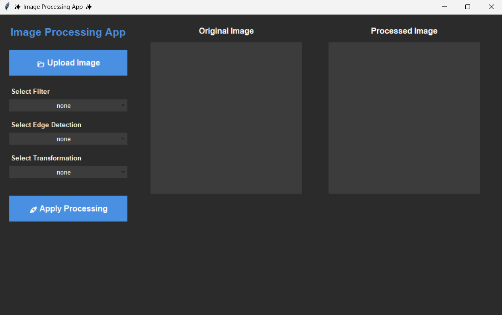

<h1 align="center">✨ Image processing Tool ✨</h1>

## Overview
This Image Processing App, built with Python’s Tkinter GUI toolkit, gives users an intuitive desktop interface to load, view, and transform images in real time. It neatly organizes operations into three dropdowns—Spatial Filters (Mean, Gaussian, Median, Bilateral, Unsharp Mask, Non-Local Means), Edge Detectors (Sobel, Prewitt, Laplacian, Canny, Roberts, Scharr), and Transformations (Scaling, Rotation, Translation, Shearing, Reflection, Affine & Perspective warps, Log, Gamma, Fourier)—so users can mix and match effects without writing a single line of code. Under the hood, it leverages OpenCV and NumPy for fast pixel-level manipulations and uses Pillow to bridge array data into the Tkinter canvases.

### UI 
 

## Setup Steps

- Clone the Repository

```
git clone https://github.com/DileepGhanta/Image-Processing-Tool.git
```

- Install Dependencies 
```
pip install opencv-python numpy pillow tk
```

- Run Program
```
python app.py 
```

